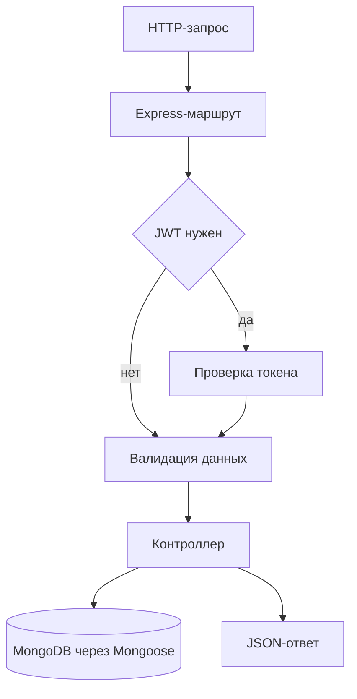

# qrver-express-api

REST API на Express, MongoDB и JWT. Проект демонстрирует регистрацию и авторизацию пользователей, защищённые операции со статьями и загрузку изображений.

## Возможности

- регистрация и авторизация пользователей с хешированием паролей через bcryptjs;
- выдача JWT и получение профиля текущего пользователя;
- создание, чтение, редактирование и удаление статей;
- валидация входных данных через express-validator;
- загрузка изображений в локальное хранилище с безопасными именами файлов;
- запуск API и MongoDB одной командой Docker Compose;
- healthcheck приложения и базы данных.

## Стек и архитектура

JavaScript, Node.js 22, Express 5, MongoDB 8, Mongoose, JWT, Docker Compose.

Приложение построено как небольшой модульный монолит: `index.js` отвечает за подключение к базе данных и жизненный цикл HTTP-сервера, `app.js` собирает маршруты Express, контроллеры содержат прикладную логику, модели описывают коллекции MongoDB.

## Переменные окружения

Секреты хранятся только в локальном `.env.local` и не попадают в Git или Docker- образ. Начните с шаблона:

```bash
cp .env.example .env.local
```

| Переменная | Назначение |
| --- | --- |
| `PORT` | HTTP-порт приложения, по умолчанию `4444` |
| `MONGO_URI` | строка подключения к MongoDB |
| `JWT_SECRET` | секрет подписи JWT |
| `UPLOADS_DIR` | каталог для загруженных файлов, по умолчанию `uploads` |

Для Docker Compose значение `MONGO_URI` задаётся внутри сети контейнеров, а
`JWT_SECRET` берётся из `.env.local`.

## Запуск через Docker

Требования: Docker Engine и Docker Compose v2.

```bash
cp .env.example .env.local
docker compose --env-file .env.local up --build
```

Проверка API:

```bash
curl http://localhost:4444/health
```

Ожидаемый ответ:

```json
{"status":"ok"}
```

Остановка сервисов:

```bash
docker compose down
```

Удаление локального тома MongoDB:

```bash
docker compose down -v
```

Compose запускает MongoDB во внутренней сети без публикации её порта наружу. Приложение ждёт успешный healthcheck базы данных, запускается от непривилегированного пользователя и сохраняет данные MongoDB в именованном Docker-томе.

## Локальный запуск

Для локального запуска нужен доступный MongoDB на `localhost:27017`.

```bash
npm ci
npm test
npm start
```

Для разработки с автоматическим перезапуском:

```bash
npm run start:dev
```

Приложение загружает `.env.local` раньше `.env`. При отсутствии обязательных переменных запуск завершается с понятным сообщением, не создавая подключение с неполными параметрами.

## API

| Метод | Путь | Доступ | Назначение |
| --- | --- | --- | --- |
| `GET` | `/` | публичный | метаданные сервиса |
| `GET` | `/health` | публичный | проверка доступности API |
| `POST` | `/auth/register` | публичный | регистрация пользователя |
| `POST` | `/auth/login` | публичный | авторизация и получение JWT |
| `GET` | `/auth/me` | JWT | профиль текущего пользователя |
| `GET` | `/posts` | публичный | список статей |
| `GET` | `/posts/:id` | публичный | статья с увеличением счётчика просмотров |
| `POST` | `/posts` | JWT | создание статьи |
| `PATCH` | `/posts/:id` | JWT | обновление статьи |
| `DELETE` | `/posts/:id` | JWT | удаление статьи |
| `POST` | `/upload` | JWT | загрузка изображения в `uploads` |

Для защищённых маршрутов передавайте заголовок:

```text
Authorization: Bearer <jwt>
```

Основные поля регистрации: `email`, `password`, `fullName`, необязательное `avatarUrl`. Для статьи используются `title`, `text`, `tags` и необязательное `imageUrl`.

## Поток запроса



## Структура проекта

Команда для просмотра дерева:

```bash
tree -L 3
```

Основные пути:

```text
index.js # подключение к MongoDB и запуск сервера
app.js # Express-приложение и HTTP-маршруты
config/env.js # загрузка и проверка конфигурации
controllers # логика пользователей и статей
models # модели MongoDB
utils # JWT-проверка и обработка ошибок валидации
validations # правила проверки входных данных
tests # smoke-тесты публичных маршрутов
docker-compose.yml # API, MongoDB, сеть и healthchecks
```
