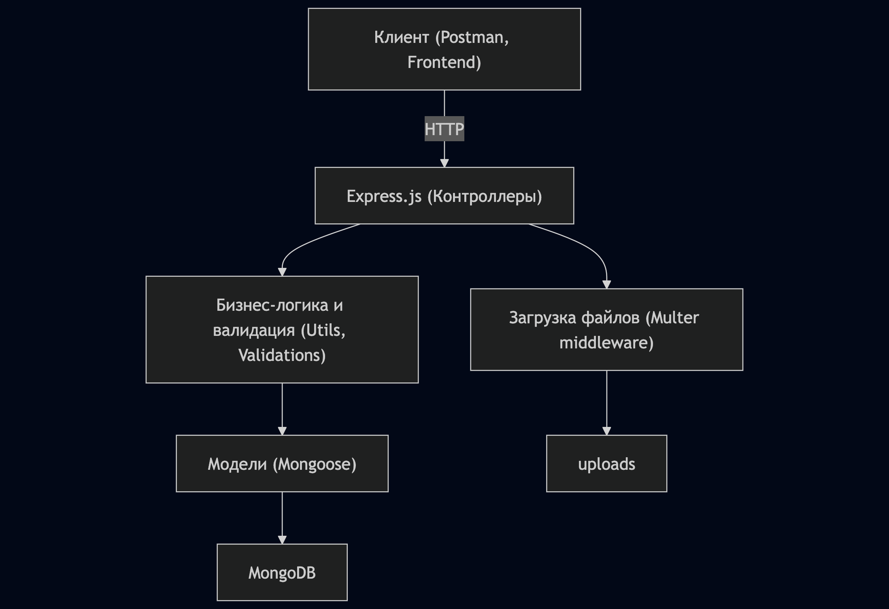
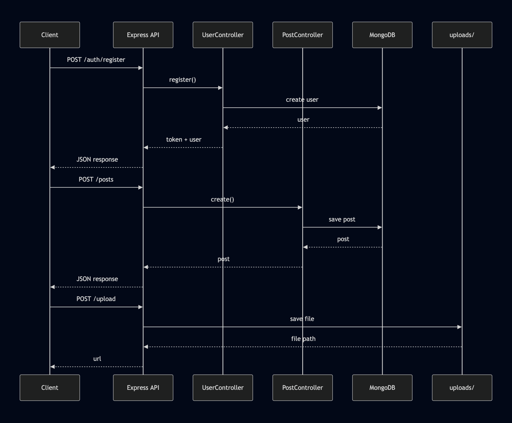
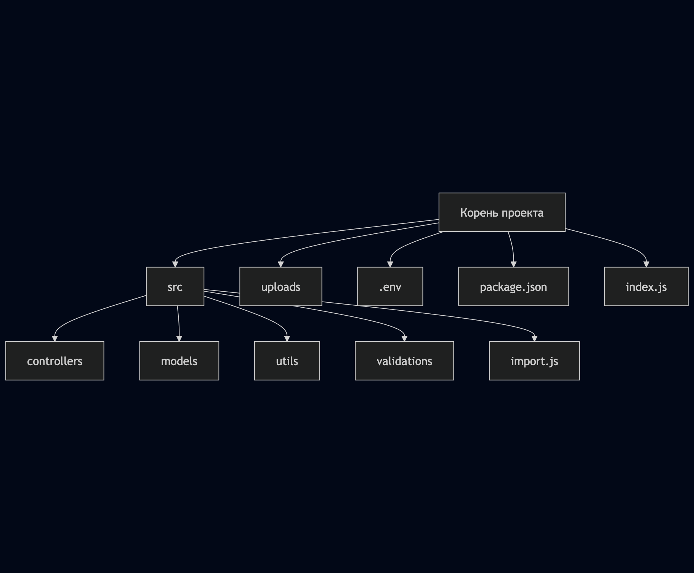
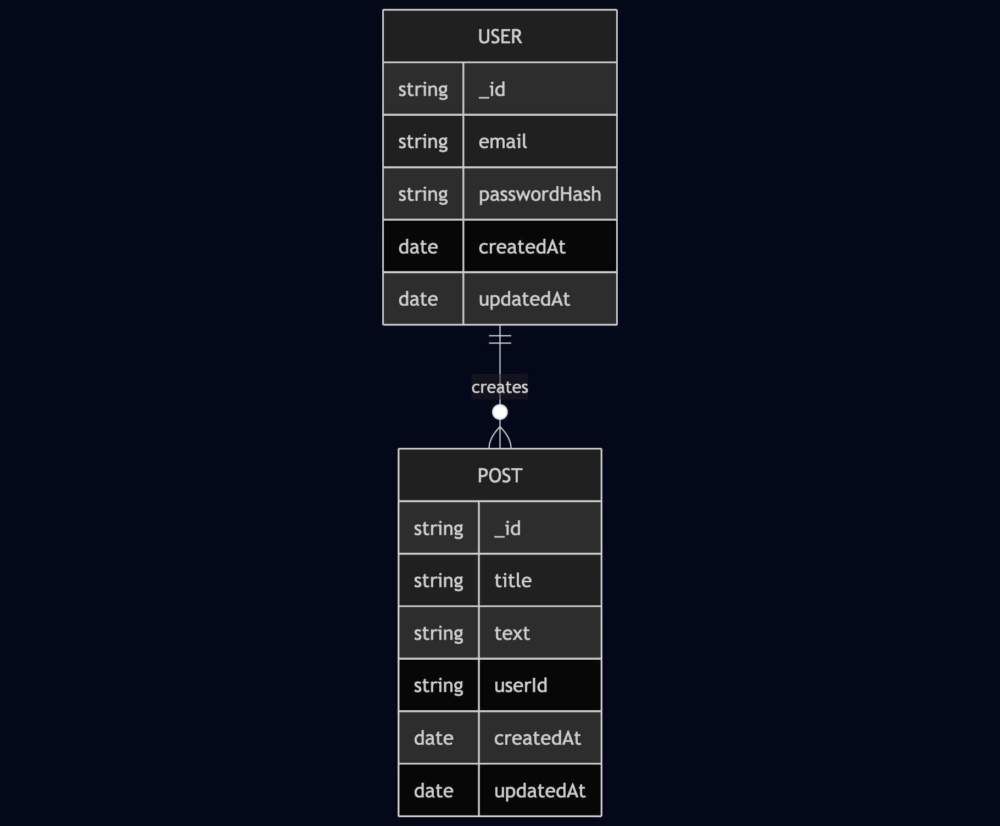

# Техническая документация Express-JS-Pet

## 1. Общая архитектура проекта

### 1.1 Диаграмма архитектуры (MVC)



### 1.2 Описание слоёв

- **Контроллеры**: принимают HTTP-запросы, вызывают бизнес-логику, возвращают ответы.
- **Бизнес-логика/Утилиты**: валидация, авторизация, обработка ошибок.
- **Модели**: описание схем MongoDB через Mongoose.
- **Хранилище файлов**: Multer сохраняет файлы в папку uploads/.
- **База данных**: MongoDB Atlas.

## 2. Компоненты приложения

### 2.1 Модули

- **Аутентификация**: регистрация, вход, JWT, middleware checkAuth.
- **Посты**: CRUD для постов, привязка к пользователю.
- **Загрузка файлов**: Multer, отдача файлов через /uploads.
- **Валидация**: express-validator

### 2.2 Взаимодействие компонентов



### 2.3 Структура каталогов



## 3. Работа с данными

### 3.1 Модель базы данных (ER-диаграмма)



### 3.2 Примеры API-запросов (JSON)

#### Регистрация пользователя

```json
{
  "email": "user@example.com",
  "password": "123456",
  "fullName": "Имя"
}
```

#### Создание поста

```json
{
  "title": "Мой пост",
  "text": "Текст поста"
}
```

#### Ответ при получении поста

```json
{
  "_id": "...",
  "title": "...",
  "text": "...",
  "user": { "_id": "...", "email": "..." },
  "createdAt": "..."
}
```

### 3.3 Форматы данных

- Все данные передаются и возвращаются в формате JSON.
- Для загрузки файлов используется multipart/form-data.

## 4. Валидация и обработка ошибок

### 4.1 Валидация

- Используется express-validator для проверки email, пароля, полей поста.
- Валидация реализована как middleware (см. src/validations/verify.js).
- При ошибке валидации возвращается статус 400 и массив ошибок.

#### Пример ошибки валидации

```json
{
  "errors": [
    { "msg": "Некорректный email", "param": "email" }
  ]
}
```

### 4.2 Обработка ошибок

- Все ошибки обрабатываются централизованно через middleware ValidationErr.
- Ошибки авторизации — статус 401, ошибки доступа — 403, не найдено — 404, серверные — 500.
- Сообщения об ошибках всегда в формате JSON.

#### Пример ошибки авторизации

```json
{
  "message": "Нет доступа"
}
```

## 5. Используемые технологии и библиотеки

| Технология         | Назначение                        |
|--------------------|-----------------------------------|
| Node.js            | Серверная платформа               |
| Express.js         | Веб-фреймворк                     |
| Mongoose           | ODM для MongoDB                   |
| MongoDB Atlas      | Хостинг базы данных               |
| Multer             | Загрузка файлов                   |
| express-validator  | Валидация входных данных          |
| jsonwebtoken       | JWT-аутентификация                |
| bcrypt             | Хеширование паролей               |
| dotenv             | Переменные окружения              |
| nodemon            | Автоматический рестарт сервера    |

