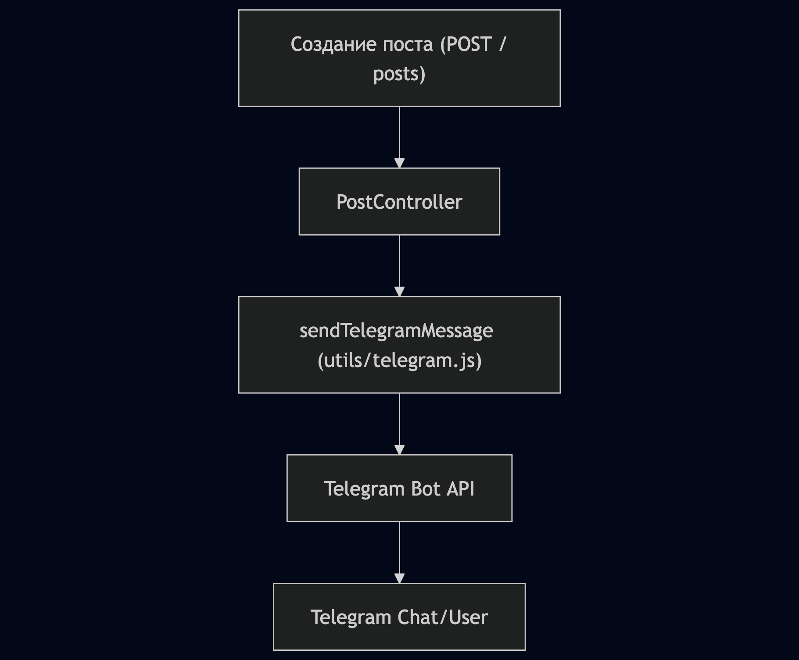

# Интеграция с Telegram-ботом в Express-JS-Pet

Проект Express-JS-Pet интегрирован с Telegram-ботом. При создании нового поста отправляется уведомление в Telegram-чат. Используется Telegram Bot API и модуль node-fetch. Интеграция протестирована — сообщения приходят корректно, ошибки логируются. Код интеграции вынесен в отдельный модуль utils/telegram.js

## Архитектура интеграции



- В контроллере создания поста после успешного сохранения вызывается функция отправки сообщения в Telegram.
- Вся логика интеграции вынесена в отдельный модуль `src/utils/telegram.js`
- Для отправки используется Telegram Bot API через HTTP-запрос.

## Настройка интеграции

1. **Создайте Telegram-бота** через [@BotFather](https://t.me/BotFather) и получите токен

2. **Получите chat_id** (ID пользователя или группы, куда бот будет отправлять сообщения)

3. **Добавьте переменные в .env:**

```env
TELEGRAM_BOT_TOKEN=your_telegram_bot_token
TELEGRAM_CHAT_ID=your_telegram_chat_id
```

## Код интеграции

### src/utils/telegram.js

```js
import fetch from 'node-fetch';

const TELEGRAM_BOT_TOKEN = process.env.TELEGRAM_BOT_TOKEN;
const TELEGRAM_CHAT_ID = process.env.TELEGRAM_CHAT_ID;

export async function sendTelegramMessage(message) {
  if (!TELEGRAM_BOT_TOKEN || !TELEGRAM_CHAT_ID) {
    console.error('TELEGRAM_BOT_TOKEN или TELEGRAM_CHAT_ID не заданы в .env');
    return;
  }
  const url = `https://api.telegram.org/bot${TELEGRAM_BOT_TOKEN}/sendMessage`;
  try {
    const res = await fetch(url, {
      method: 'POST',
      headers: { 'Content-Type': 'application/json' },
      body: JSON.stringify({
        chat_id: TELEGRAM_CHAT_ID,
        text: message
      })
    });
    const data = await res.json();
    if (!data.ok) {
      console.error('Ошибка Telegram:', data);
    }
    return data;
  } catch (err) {
    console.error('Ошибка отправки в Telegram:', err);
  }
}
```

### src/controllers/PostController.js (фрагмент)

```js
import { sendTelegramMessage } from '../utils/telegram.js';

export const create = async (req, res) => {
  // ...
  const post = await doc.save();
  try {
    const user = req.userId;
    await sendTelegramMessage(`📝 Новый пост: "${post.title}"\nАвтор: ${user}`);
  } catch (e) {
    console.error('Ошибка отправки уведомления в Telegram:', e);
  }
  res.json(post);
}
```

## Тестирование интеграции

1. Запустите сервер с корректно настроенными переменными окружения.
2. Создайте новый пост через API (POST /posts)
3. Проверьте, что в Telegram-чат пришло уведомление с заголовком поста и id автора
4. В случае ошибки отправки уведомления — ошибка будет залогирована в консоль, но создание поста не прервётся

## Обработка ошибок

- Если переменные окружения не заданы — в консоль выводится ошибка, уведомление не отправляется

- Если Telegram API возвращает ошибку — она логируется, но не влияет на основной бизнес-процесс

- Все ошибки интеграции не мешают работе основного приложения

## Безопасность

- Никогда не публикуйте токен Telegram-бота и chat_id в публичных репозиториях.

- Рекомендуется ограничить доступ бота только к нужным чатам/группам.