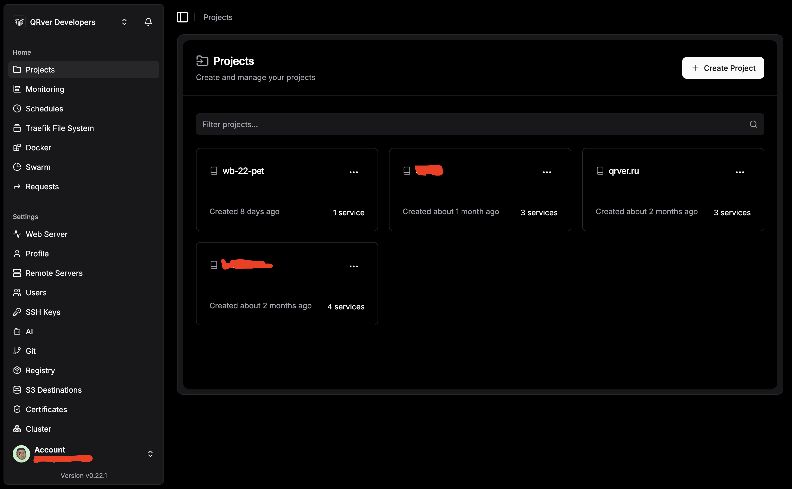
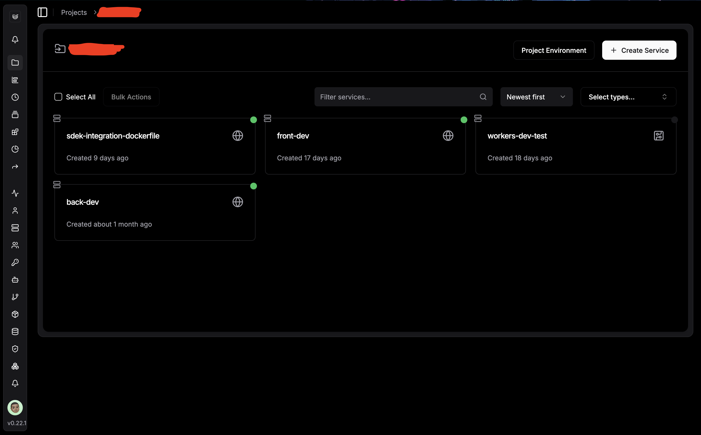
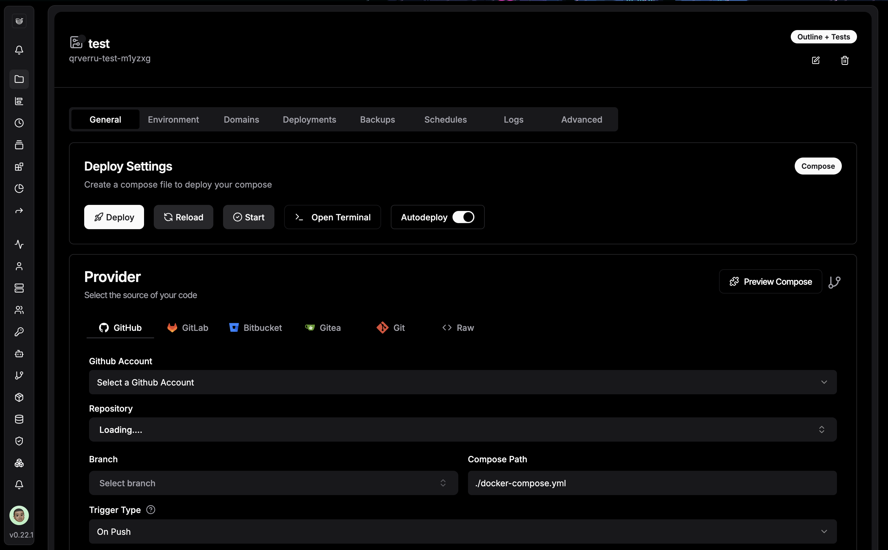
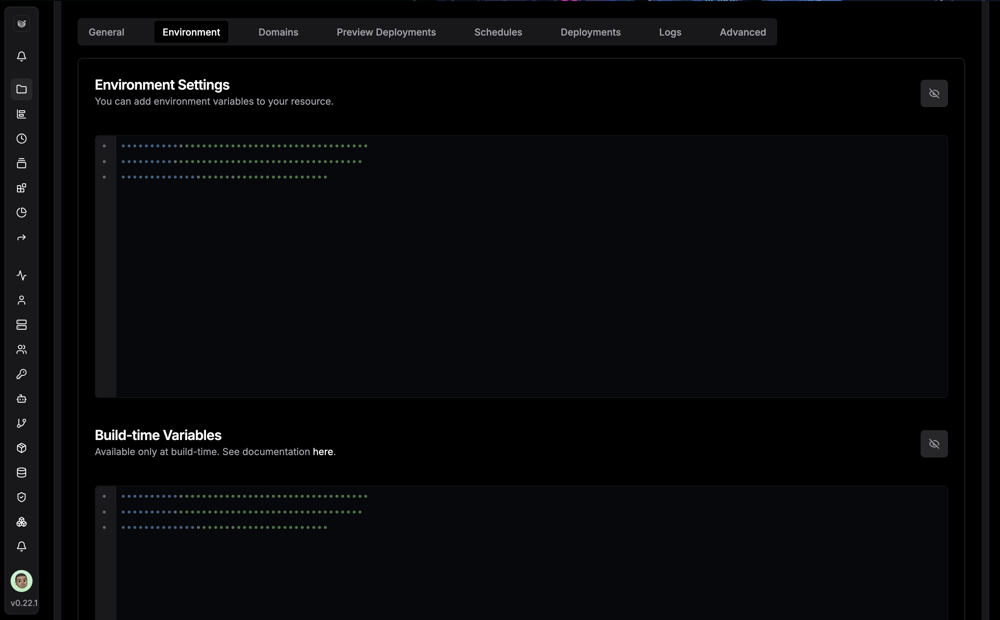
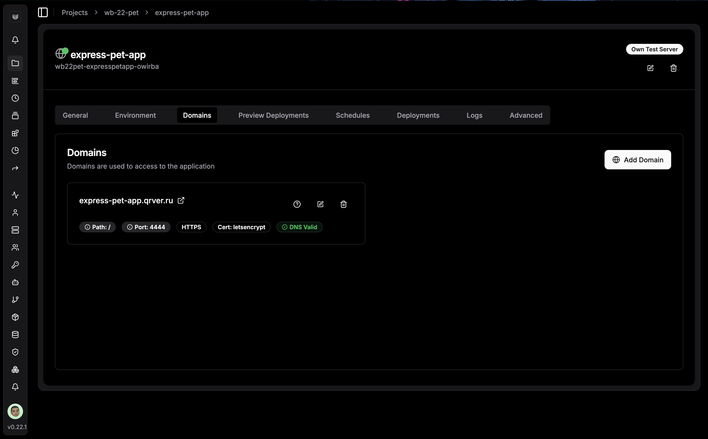
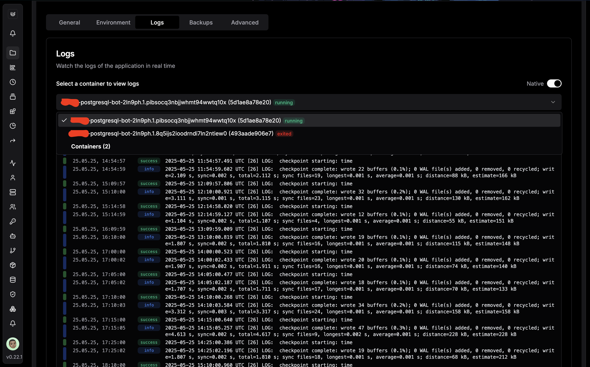
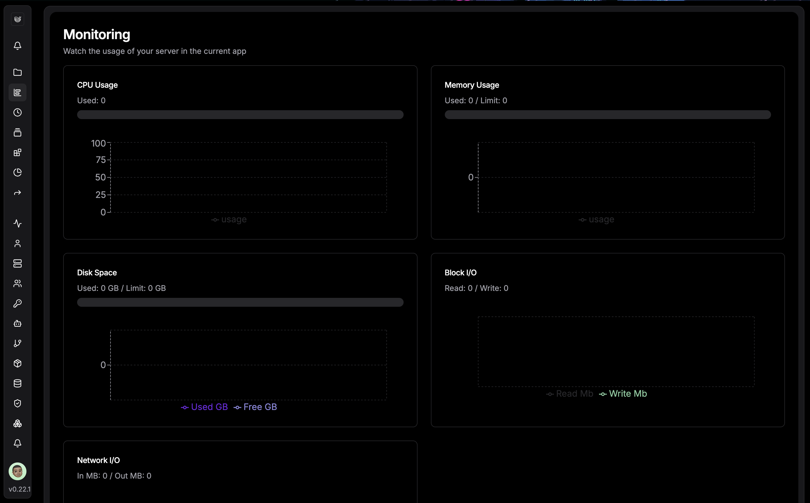

# Исследование: Dokploy и современные DevOps/Low-code практики для Express-JS-Pet

## Введение

**Dokploy** — это open-source PaaS (Platform as a Service), сочетающая DevOps-подходы (CI/CD, контейнеризация, мониторинг) и Low-code инструменты (шаблоны, визуальное управление). Она позволяет быстро и удобно развертывать, обновлять и сопровождать современные веб-приложения

## Что такое Dokploy и зачем он нужен?

Панель проекта в Dokploy:

- **Автоматизация деплоя**: Быстрый запуск и обновление приложений через интеграцию с GitHub/GitLab/Bitbucket.
- **Контейнеризация**: Использование Docker-контейнеров для изоляции и масштабирования сервисов.
- **Low-code**: Визуальный интерфейс для управления приложениями, шаблоны для популярных стеков.
- **Мониторинг**: Встроенные инструменты для отслеживания состояния приложений и ресурсов.

**Зачем это нужно?**

Панель проекта в Dokploy:

- Упрощает деплой и обновление (push в git — автоматический релиз).
- Позволяет быстро настраивать переменные окружения (MongoDB, JWT, Telegram).
- Дает визуальный контроль над состоянием приложения и логами.

## Какие проблемы решает Dokploy?

- **Сложность ручного деплоя**: Не нужно вручную настраивать nginx, docker-compose, SSL, переменные окружения.
- **Долгий time-to-market**: Быстрый запуск новых версий через CI/CD и автодеплой из Git.
- **Ошибки при обновлениях**: Автоматические откаты и мониторинг состояния контейнеров.
- **Высокая стоимость облачных платформ**: Возможность самохостинга на своем VPS, что дешевле аналогов (Heroku, Render, Railway).
- **Отсутствие единой панели управления**: В Dokploy есть web-интерфейс для управления приложениями, БД, логами и ресурсами.

Панель приложения в Dokploy:

Настройка переменных окружения:

Настройка доменного имени:

Логи приложения (в реальном времени, в примере postgresql и виден упавший старый контейнер):

Мониторинг ресурсов:

## Как применяется Dokploy?

- **Стартапы**: Быстрый запуск MVP без DevOps-специалиста
- **Малые команды**: Автоматизация CI/CD, мониторинг, масштабирование без сложных скриптов
- **Образовательные проекты**: Легко развернуть учебные проекты, pet-проекты, staging-окружения
- **Интеграция с внешними сервисами**: Например, автоматическая отправка уведомлений в Telegram при деплое (webhook)

## Применение Dokploy для Express-JS-Pet

### Как это выглядит на практике:

1. **Автоматизация деплоя**  
   - Подключаем репозиторий Express-JS-Pet к Dokploy
   - Настраиваем автосборку и автозапуск контейнера при каждом push в main/master
   - Все переменные окружения (MongoDB, JWT, Telegram) задаются через web-интерфейс Dokploy

2. **Мониторинг и управление**  
   - В реальном времени видим логи приложения, нагрузку на CPU/RAM, статус контейнера
   - Можно перезапустить, откатить или обновить приложение в один клик

3. **Работа с файлами и БД**  
   - Управление папкой uploads/ (например, монтирование в контейнер, бэкапы, работа через консоль в веб-интерфейсе)
   - Визуальное управление MongoDB (создание бэкапов, восстановление, работа через консоль в веб-интерфейсе, логи) (но MongoDB не поддерживается в Dokploy, как SaaS решение, поэтому придется использовать другой сервис или разворачивать самостоятельно через docker-compose)

4. **Безопасность и масштабирование**  
   - Автоматическая генерация SSL-сертификатов (через Let's Encrypt)
   - Масштабирование приложения (например, запуск нескольких инстансов Node.js)

## Плюсы и минусы подхода

### Плюсы

- **Скорость и простота**: Быстрый деплой без ручных скриптов
- **Визуальный контроль**: Всё управление через web-интерфейс
- **Гибкость**: Поддержка любых Docker-контейнеров
- **Экономия**: Можно использовать свой VPS, не переплачивая за облако
- **Интеграция с Git**: Автоматизация CI/CD

### Минусы

- **Молодой проект**: Возможны баги и недоработки
- **Ограниченная поддержка сложных сценариев (Kubernetes, multi-cloud)**
- **Требуются базовые знания Linux/Docker для самохостинга**
- **Меньше автоматизации, чем у крупных облаков (AWS, GCP)**

## Заключение: стоит ли использовать Dokploy?

**Dokploy** — отличное решение для небольших команд, pet-проектов и стартапов, которым важны скорость, простота и контроль над инфраструктурой. Позволяет быстро выкатывать новые версии, не тратить время на ручной деплой и всегда иметь под рукой мониторинг и управление. Для крупных production-проектов с высокими требованиями к отказоустойчивости и безопасности стоит рассмотреть более зрелые решения, но для учебных и средних коммерческих проектов Dokploy — отличный выбор

<!-- ## Ссылки и источники

- [Официальный сайт Dokploy](https://dokploy.com/)
- [Документация Dokploy](https://docs.dokploy.com/)
- [GitHub Dokploy](https://github.com/dokploy/dokploy) -->
