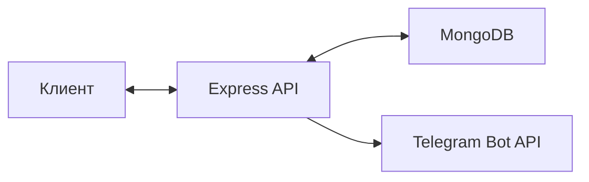
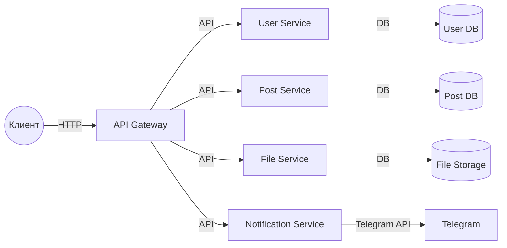
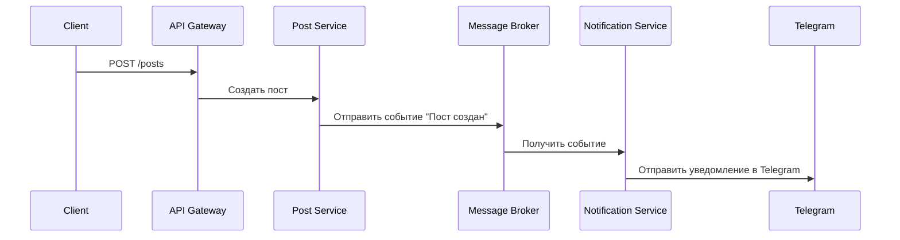
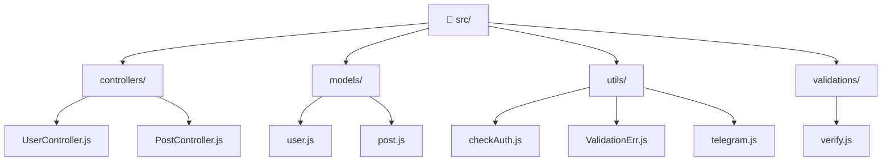
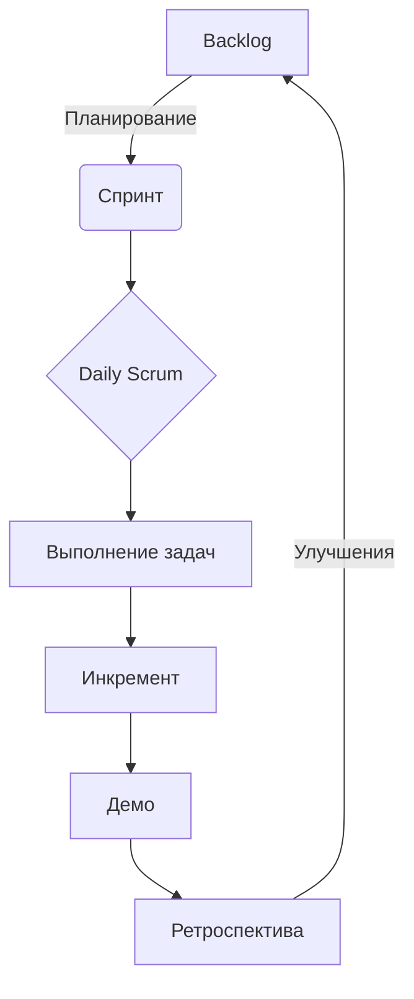
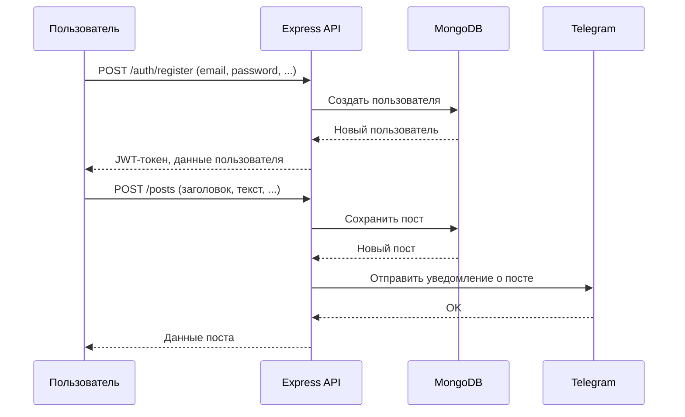

# Презентация итогового проекта: Express-JS-Pet

---

## 1. Название проекта и краткое описание

**Express-JS-Pet** — серверное приложение на Node.js с использованием Express и MongoDB, предназначенное для управления пользователями, постами и загрузкой файлов. Проект реализует базовые функции аутентификации, управления постами и загрузки изображений.

**Ключевые особенности:**
- REST API с JWT-аутентификацией
- Интеграция с Telegram для уведомлений
- Загрузка и хранение изображений
- Контейнеризация через Docker

---

## 2. Целевая аудитория и ключевые функции

**Целевая аудитория:**
- Разработчики, изучающие Node.js, Express и MongoDB
- Студенты и преподаватели, которым нужен пример современного REST API
- Владельцы небольших блогов или внутренних корпоративных порталов

**Ключевые функции:**
- Регистрация и вход пользователей с JWT-аутентификацией
- CRUD-операции с постами (создание, чтение, обновление, удаление)
- Загрузка изображений через API
- Уведомления о новых постах в Telegram-канал
- Валидация данных и обработка ошибок

---

## 3. Архитектура и технологии

### Архитектурная схема (текстовая):



### Структура проекта:

- **controllers/** — бизнес-логика (UserController, PostController)
- **models/** — схемы данных (User, Post)
- **utils/** — вспомогательные функции (валидация, аутентификация, Telegram)
- **validations/** — схемы валидации для express-validator

### Пример схемы данных (Mongoose):

**User:**
```js
const UserSchema = new mongoose.Schema({
  fullName: { type: String, required: true },
  email:    { type: String, required: true, unique: true },
  passwordHash: { type: String, required: true },
  avatarUrl: String
}, { timestamps: true });
```

**Post:**
```js
const PostSchema = new mongoose.Schema({
  title:     { type: String, required: true },
  text:      { type: String, required: true },
  tags:      { type: Array, default: [] },
  viewsCount:{ type: Number, default: 0 },
  user:      { type: mongoose.Schema.Types.ObjectId, ref: 'User', required: true },
  imageUrl:  String
}, { timestamps: true });
```

### Используемые технологии:

| Технология         | Назначение                                 |
|--------------------|--------------------------------------------|
| express            | REST API, маршрутизация                    |
| mongoose           | ODM для MongoDB                            |
| dotenv             | Переменные окружения                       |
| bcrypt             | Хэширование паролей                        |
| jsonwebtoken       | JWT-аутентификация                         |
| express-validator  | Валидация данных                           |
| multer             | Загрузка файлов                            |
| node-fetch         | Интеграция с Telegram                      |
| Docker             | Контейнеризация                            |

### 3.1. Архитектурные решения: переход к микросервисам

Для масштабирования и повышения отказоустойчивости Express-JS-Pet можно внедрить микросервисную архитектуру. Такой подход позволит разделить приложение на независимые сервисы, каждый из которых отвечает за свою бизнес-логику и может масштабироваться отдельно.

### Как можно реализовать микросервисную архитектуру:

- **User Service** — управление пользователями, аутентификация, хранение профилей
- **Post Service** — управление постами, хранение и обработка контента
- **File Service** — загрузка и хранение файлов/изображений
- **Notification Service** — отправка уведомлений (например, интеграция с Telegram)
- **API Gateway** — единая точка входа для клиентов, маршрутизация запросов к нужным сервисам
- **Message Broker (RabbitMQ, Kafka)** — асинхронное взаимодействие между сервисами (например, для отправки уведомлений)
- **Service Discovery** — автоматическое обнаружение сервисов в кластере

### Преимущества микросервисной архитектуры:
- Масштабирование отдельных компонентов под нагрузкой
- Независимое развертывание и обновление сервисов
- Устойчивость к сбоям отдельных частей
- Возможность использовать разные технологии для разных сервисов

### Mermaid-схема: базовая микросервисная архитектура



### Mermaid-схема: взаимодействие через очередь сообщений



### Подробная структура проекта (mermaid)



---

## 4. Как велась работа: этапы, подходы, проблемы

### Этапы разработки:
1. Анализ требований и проектирование архитектуры (см. ПР 24, 25, 26)
2. Реализация базовой структуры проекта
3. Разработка моделей данных
4. Реализация аутентификации и регистрации пользователей
5. CRUD для постов, включая валидацию и авторизацию
6. Загрузка файлов и организация статического доступа
7. Интеграция с Telegram для уведомлений (см. ПР 30)
8. Обработка ошибок, доработка UX API
9. Документирование и подготовка к запуску в Docker (см. ПР 27, 28)

### Использованные подходы:
- MVC (разделение ответственности)
- Middleware для валидации и аутентификации
- Использование шаблонов проектирования (Singleton для Telegram-бота)
- CI/CD (см. ПР 31)

### Проблемы и их решения:
- Валидация данных: express-validator
- Безопасность хранения паролей: bcrypt
- Контроль доступа к постам: проверка авторства
- Интеграция с Telegram: node-fetch

## 4.1. Применение Agile и Scrum в проекте

В процессе реализации Express-JS-Pet мы активно использовали подходы Agile и Scrum для повышения прозрачности, управляемости и эффективности командной работы.

### Как это выглядело на практике:

- **Роли:**
  - Product Owner — постановка задач, приоритизация фич, обратная связь.
  - Scrum Master — контроль соблюдения процессов, фасилитация встреч.
  - Developers — реализация задач, написание кода, тестирование.

- **Спринты:**
  - Каждый спринт длился 1 неделю.
  - В начале спринта проводилось планирование: определяли цели, задачи, критерии готовности.
  - В конце — демо и ретроспектива: показывали реализованный функционал, обсуждали, что улучшить в процессе.

- **Daily Scrum (ежедневные стендапы):**
  - Каждый день коротко обсуждали: что сделано, что мешает, что планируется.

- **Backlog:**
  - Вся работа велась через бэклог (Trello/Notion/доска задач), где задачи были разбиты по приоритету и сложности.

- **Ретроспектива:**
  - После каждого спринта обсуждали, что получилось хорошо, а что можно улучшить (например, ускорить ревью кода, чаще писать тесты).

- **Инкремент:**
  - В конце каждого спринта был рабочий инкремент — часть функционала, которую можно показать и протестировать.

### Пример Scrum-доски (Trello):
- Backlog: Регистрация, Аутентификация, CRUD постов, Загрузка файлов, Интеграция с Telegram, Docker
- To Do: Текущие задачи спринта
- In Progress: В работе
- Review: На ревью
- Done: Готово

### Mermaid-диаграмма процесса Scrum:



## 4.2. Применение шаблонов проектирования в проекте

В ходе разработки Express-JS-Pet мы анализировали, где могут быть полезны порождающие шаблоны проектирования. Это позволяет сделать архитектуру более гибкой, расширяемой и устойчивой к ошибкам.

### Анализ применения шаблонов

- **Singleton**
  - Подключение к базе данных (MongoDB) обычно реализуется как единственный экземпляр соединения на всё приложение. Это предотвращает создание лишних подключений и снижает нагрузку на БД.
  - В нашем проекте также реализован паттерн Singleton для Telegram-бота: функция отправки сообщений использует одни и те же параметры подключения, что предотвращает дублирование и ошибки при интеграции с внешним API.

- **Factory**
  - Factory-подход может быть полезен для создания объектов разных типов (например, разных видов задач или постов). В нашем проекте модели пользователей и постов создаются через Mongoose, который сам по себе реализует фабричный подход к созданию экземпляров моделей.

### Почему выбран Singleton для Telegram-бота

- Необходимо, чтобы параметры подключения к Telegram-боту (токен, chat_id) были едиными и не создавались заново при каждом запросе.
- Это позволяет централизованно управлять отправкой уведомлений и легко масштабировать сервис уведомлений.

### Пример реализации Singleton для Telegram-бота

```js
// src/utils/telegram.js
import fetch from 'node-fetch';

let instance = null;

class TelegramBot {
  constructor() {
    if (!process.env.TELEGRAM_BOT_TOKEN || !process.env.TELEGRAM_CHAT_ID) {
      throw new Error('Не заданы параметры Telegram');
    }
    this.token = process.env.TELEGRAM_BOT_TOKEN;
    this.chatId = process.env.TELEGRAM_CHAT_ID;
  }

  async sendMessage(message) {
    const url = `https://api.telegram.org/bot${this.token}/sendMessage`;
    await fetch(url, {
      method: 'POST',
      headers: { 'Content-Type': 'application/json' },
      body: JSON.stringify({ chat_id: this.chatId, text: message })
    });
  }
}

export function getTelegramBot() {
  if (!instance) {
    instance = new TelegramBot();
  }
  return instance;
}
```

**Использование:**
```js
import { getTelegramBot } from './utils/telegram.js';

const bot = getTelegramBot();
bot.sendMessage('Привет из Singleton!');
```

### Почему Factory не был явно реализован

- Для создания моделей (User, Post) используется Mongoose, который уже реализует фабричный подход.
- Если бы в проекте требовалось создавать разные типы постов или задач с разной логикой, можно было бы реализовать отдельную фабрику.

## 4.3. Другие паттерны программирования в проекте

В Express-JS-Pet были применены и другие архитектурные и поведенческие паттерны:

- **MVC (Model-View-Controller)**
  - В проекте чётко разделены модели (models/), контроллеры (controllers/) и вспомогательные функции (utils/). Такой подход облегчает поддержку и масштабирование кода.

- **Middleware**
  - В Express активно используются middleware для валидации, аутентификации, обработки ошибок. Это позволяет централизованно управлять обработкой запросов и повторно использовать логику.

- **Dependency Injection (DI) на уровне Express**
  - В проекте зависимости (например, middleware, контроллеры) внедряются через параметры маршрутов, что облегчает тестирование и расширяемость.

- **Observer (наблюдатель)**
  - Для отправки уведомлений о новых постах реализовано событие (post created), на которое "реагирует" функция отправки сообщения в Telegram. Это пример паттерна Observer, когда изменение состояния (создание поста) инициирует действие (уведомление).

---

## UML-диаграмма последовательности основных процессов



---

## Документация проекта

Документация — важная часть проекта, обеспечивающая его поддержку, развитие и удобство для новых участников.

- **README.md**
  - Описание архитектуры, функциональных и нефункциональных требований
  - Инструкция по запуску (локально и в Docker)
  - Пример .env файла
  - Описание используемых технологий
  - Примеры сценариев использования

- **Техническая документация** (см. ПР 28)
  - Описание структуры кода, моделей, контроллеров, утилит
  - Схемы данных (User, Post)
  - Описание API и форматов запросов/ответов

- **Пользовательская инструкция** (см. ПР 27)
  - Пошаговые инструкции для конечных пользователей
  - Примеры запросов к API

- **Документация по безопасности и анализу рисков** (см. ПР 24, 25, 26)
  - Оценка угроз, рекомендации по защите данных

- **Документация по интеграции с внешними сервисами** (см. ПР 30)
  - Описание интеграции с Telegram

- **Документация по деплою и CI/CD** (см. ПР 31)
  - Описание процесса развертывания, настройки Docker, CI/CD

---

## 5. Демо: интерфейс, API, тесты, код

### Примеры запросов

**Регистрация пользователя:**
```http
POST /auth/register
{
  "email": "user@example.com",
  "password": "password123",
  "fullName": "Иван Иванов",
  "avatarUrl": "https://..."
}
```

**Вход пользователя:**
```http
POST /auth/login
{
  "email": "user@example.com",
  "password": "password123"
}
```

**Создание поста (JWT):**
```http
POST /posts
Authorization: Bearer <token>
{
  "title": "Мой первый пост",
  "text": "Текст поста...",
  "tags": ["nodejs", "express"],
  "imageUrl": "https://..."
}
```

**Загрузка изображения:**
```http
POST /upload
Authorization: Bearer <token>
Content-Type: multipart/form-data
file: <image>
```

### Пример кода: создание поста и отправка уведомления

```js
export const create = async (req, res) => {
  try {
    const doc = new PostModel({
      title: req.body.title,
      text: req.body.text,
      imageUrl: req.body.imageUrl,
      tags: req.body.tags,
      user: req.userId
    });
    const post = await doc.save();
    // Отправка уведомления в Telegram
    await sendTelegramMessage(`📝 Новый пост: "${post.title}"\nАвтор: ${req.userId}`);
    res.json(post);
  } catch (err) {
    res.status(500).json({ message: 'Не удалось создать пост' });
  }
}
```

### Пример кода: middleware для проверки JWT

```js
export default (req, res, next) => {
  const token = (req.headers.authorization || '').replace(/Bearer\s?/, '');
  if (token) {
    try {
      const decoded = jwt.verify(token, process.env.SECRET);
      req.userId = decoded._id;
      next();
    } catch (err) {
      return res.status(403).json({ message: "Нет доступа" });
    }
  } else {
    return res.status(403).json({ message: "Нет доступа" });
  }
}
```

### Пример кода: валидация данных

```js
export const registerValidation = [
  body('email', 'Неверный формат почты').isEmail(),
  body('password', 'Пароль должен быть минимум 5 символов').isLength({ min: 5 }),
  body('fullName', 'Укажите имя от 3 символов').isLength({ min: 3 }),
  body('avatarUrl', 'Неверная ссылка на аватарку').optional().isURL(),
]
```

### Пример кода: интеграция с Telegram

```js
export async function sendTelegramMessage(message) {
  const url = `https://api.telegram.org/bot${TELEGRAM_BOT_TOKEN}/sendMessage`;
  await fetch(url, {
    method: 'POST',
    headers: { 'Content-Type': 'application/json' },
    body: JSON.stringify({ chat_id: TELEGRAM_CHAT_ID, text: message })
  });
}
```

---

## 7. Что можно улучшить: выводы и пожелания на будущее

- Реализовать восстановление пароля через email
- Добавить возможность комментирования постов
- Ввести пагинацию для списка постов
- Улучшить систему прав доступа (например, роли пользователей)
- Интегрировать фронтенд (например, React/Vue)
- Добавить мониторинг и логирование
- Реализовать элементы геймификации

---

## 9. Визуализация (пример графика)

**Диаграмма архитектуры (PlantUML):**
```
@startuml
actor User
User -> API : HTTP-запросы (REST)
API -> MongoDB : CRUD-операции
API -> TelegramBot : POST /sendMessage
@enduml
```

---

## 10. Заключение

Проект Express-JS-Pet — это современный пример серверного приложения на Node.js, реализующий лучшие практики разработки REST API, безопасности и интеграции с внешними сервисами. Проект легко расширяем, хорошо документирован и готов к использованию в учебных и реальных задачах.