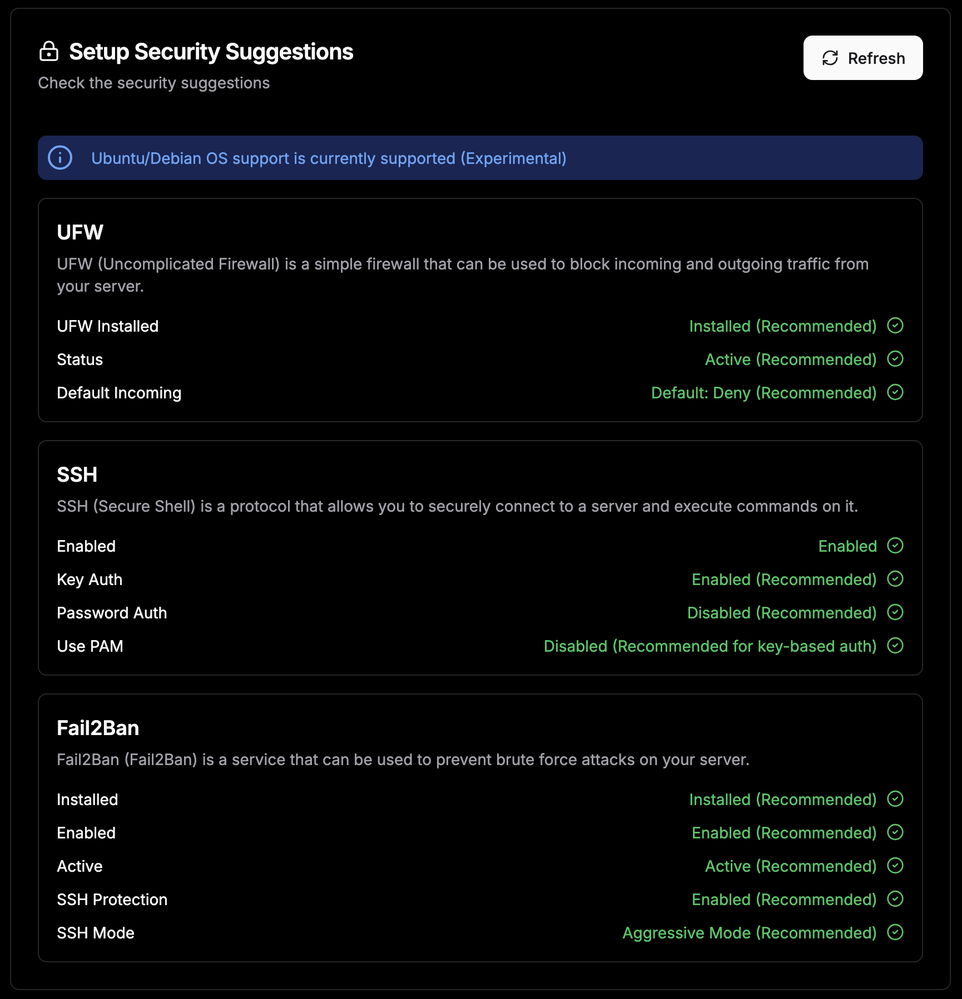

# Настройка базовой безопасности сервера

## UFW (Uncomplicated Firewall)

UFW — интерфейс для настройки брандмауэра (firewall) в Linux, основанный на iptables. Он позволяет легко управлять входящими и исходящими сетевыми соединениями.

- Защищает сервер от несанкционированного доступа, блокируя все ненужные порты.
- Позволяет разрешить только определённые сервисы (например, SSH, HTTP, HTTPS).
- Помогает предотвратить атаки из интернета, ограничивая доступ к серверу.

**Пример:**
Если UFW включён и настроен, никто не сможет подключиться к вашему серверу по произвольному порту — только по тем, которые вы явно разрешили.

**Что делать:**

- Установить UFW (если не установлен)
- Включить UFW
- По умолчанию запретить все входящие соединения
- Разрешить только нужные порты (например, SSH, HTTP/HTTPS)

**Команды:**

```bash
sudo apt update
sudo apt install ufw -y
sudo ufw default deny incoming
sudo ufw default allow outgoing
sudo ufw allow 22/tcp      # SSH
sudo ufw allow 80/tcp      # HTTP (если нужен)
sudo ufw allow 443/tcp     # HTTPS (если нужен)
sudo ufw enable
sudo ufw status verbose
```

---

## SSH (Secure Shell)

> **Важно:** Перед этим убедитесь, что уже добавлен SSH-ключ в `~/.ssh/authorized_keys`!

```bash
echo "*YOUR_SSH_KEY*" >> ~/.ssh/authorized_keys
```

SSH — это протокол для безопасного удалённого доступа к серверу. С помощью SSH можно подключаться к серверу, управлять им, передавать файлы и выполнять команды.

- Позволяет безопасно администрировать сервер через зашифрованное соединение.
- Использование ключей SSH вместо паролей делает доступ более защищённым.
- Отключение паролей и PAM (Pluggable Authentication Modules) снижает риск взлома через подбор пароля.

**Что делать:**

- Включить только авторизацию по ключу (отключить по паролю)
- Отключить PAM (если использовать ключи)
- Перезапустить SSH-сервис

**Файл для редактирования:** `/etc/ssh/sshd_config`

**Рекомендуемые параметры:**

```
PasswordAuthentication no
PubkeyAuthentication yes
UsePAM no
PermitRootLogin no
```

**Команды:**
```bash
sudo sed -i 's/^#*PasswordAuthentication.*/PasswordAuthentication no/' /etc/ssh/sshd_config
sudo sed -i 's/^#*PubkeyAuthentication.*/PubkeyAuthentication yes/' /etc/ssh/sshd_config
sudo sed -i 's/^#*UsePAM.*/UsePAM no/' /etc/ssh/sshd_config
sudo sed -i 's/^#*PermitRootLogin.*/PermitRootLogin no/' /etc/ssh/sshd_config
sudo systemctl reload sshd
```

---

## Fail2Ban

Fail2Ban — это сервис, который защищает сервер от атак перебора паролей и других подозрительных активностей. Он анализирует логи и временно блокирует IP-адреса, с которых происходят подозрительные попытки входа.

- Автоматически блокирует злоумышленников, которые пытаются подобрать пароль к SSH или другим сервисам.
- Снижает риск взлома сервера через brute force.
- Можно настроить защиту не только для SSH, но и для других сервисов (FTP, почта и т.д.).

**Пример:**  

Если кто-то пытается много раз подряд ввести неправильный пароль по SSH, Fail2Ban автоматически заблокирует его IP на заданное время.


**Что делать:**

- Установить Fail2Ban
- Включить и запустить сервис
- Включить защиту SSH в агрессивном режиме

**Команды:**
```bash
sudo apt install fail2ban -y
sudo systemctl enable fail2ban
sudo systemctl start fail2ban
sudo systemctl status fail2ban
```

**Настройка агрессивного режима для SSH:**

Создайте или отредактируйте файл `/etc/fail2ban/jail.local`:

```
[sshd]
enabled = true
mode    = aggressive
```

Примените настройки:

```bash
sudo systemctl restart fail2ban
```

---

## bash-скрипт для быстрой настройки

Скопируйте и выполните на сервере (Ubuntu/Debian):

```bash
#!/bin/bash

set -e

# === Настройки ===
# Белые IP-адреса через пробел (например: 1.2.3.4 5.6.7.8)

WHITE_IPS="212.113.102.86 147.45.72.22"

# === Проверка наличия authorized_keys ===
if [ ! -f ~/.ssh/authorized_keys ]; then
  echo "❌ Файл ~/.ssh/authorized_keys не найден. Пожалуйста, добавь свой публичный ключ вручную:"
  echo 'echo "ssh-rsa ****/*****/***== dokploy" >> ~/.ssh/authorized_keys'
  exit 1
else
  echo "✅ Файл authorized_keys найден. Продолжаю настройку."
fi

echo "=== Установка и настройка UFW ==="
sudo apt update
sudo apt install ufw -y
sudo ufw default deny incoming
sudo ufw default allow outgoing

# Разрешаем SSH только с белых IP
for ip in $WHITE_IPS; do
  sudo ufw allow from $ip to any port 22 proto tcp
done

# Разрешаем HTTP/HTTPS для всех
sudo ufw allow 80/tcp
sudo ufw allow 443/tcp
sudo ufw --force enable
sudo ufw status verbose

echo "=== Установка и настройка Fail2Ban ==="
sudo apt install fail2ban -y
sudo systemctl enable fail2ban
sudo systemctl start fail2ban

# Формируем строку ignoreip для Fail2Ban
IGNOREIP="127.0.0.1/8"
for ip in $WHITE_IPS; do
  IGNOREIP="$IGNOREIP $ip"
done

# Создаём/обновляем jail.local для Fail2Ban
sudo bash -c "cat > /etc/fail2ban/jail.local" <<EOL
[DEFAULT]
ignoreip = $IGNOREIP

[sshd]
enabled = true
mode    = aggressive
EOL

sudo systemctl restart fail2ban
sudo systemctl status fail2ban

echo '=== Белые IP добавлены в UFW и Fail2Ban. Сервер защищён UFW и Fail2Ban ==='

echo "=== Настройка SSH ==="
sudo sed -i 's/^#*PasswordAuthentication.*/PasswordAuthentication no/' /etc/ssh/sshd_config
sudo sed -i 's/^#*PubkeyAuthentication.*/PubkeyAuthentication yes/' /etc/ssh/sshd_config
sudo sed -i 's/^#*UsePAM.*/UsePAM no/' /etc/ssh/sshd_config
sudo sed -i 's/^#*PermitRootLogin.*/PermitRootLogin no/' /etc/ssh/sshd_config
sudo systemctl reload sshd
```

---

## Итог

- **UFW**: блокирует все входящие, кроме нужных портов.
- **SSH**: только по ключу, без пароля, без PAM, root-вход запрещён.
- **Fail2Ban**: защита от брутфорса SSH, агрессивный режим.


