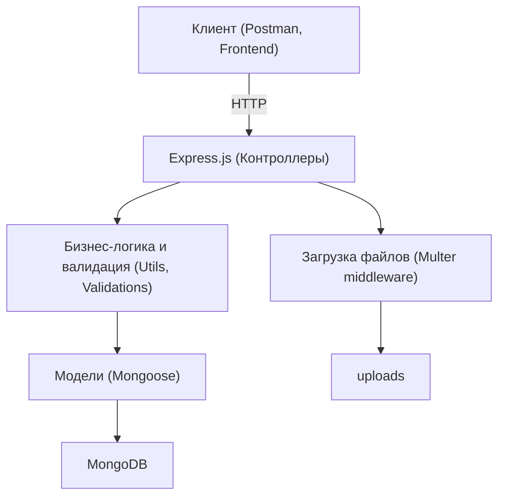
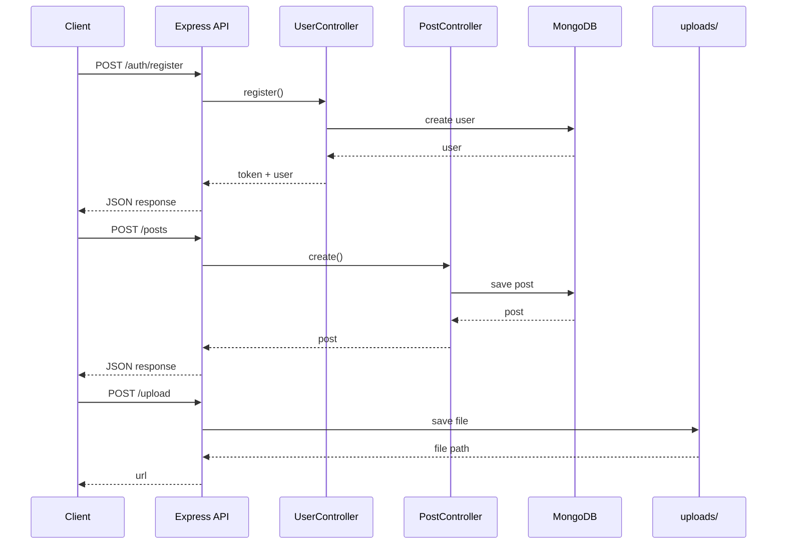
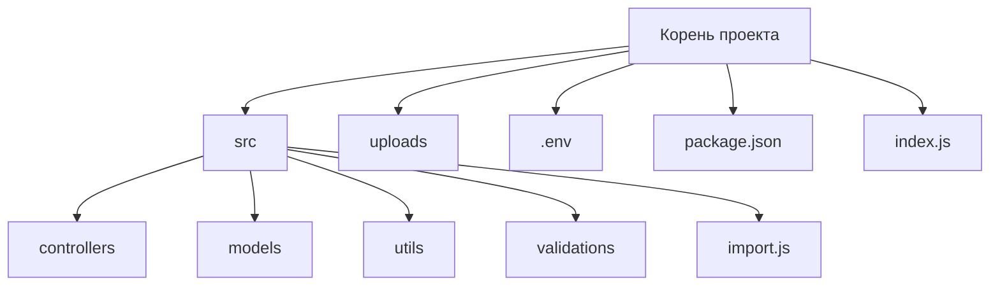
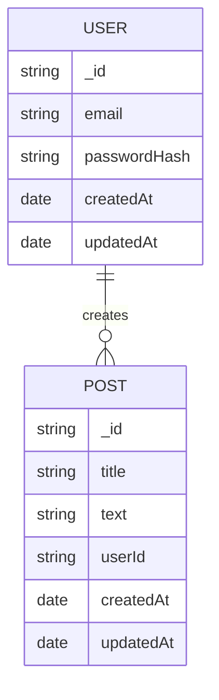

## Практическая работа 28: Создание технической документации

## Задание
- Подготовьте техническую документацию для вашего проекта.  
- Опишите архитектуру, основные компоненты и ключевые проектные решения.  
- Документация предназначена для разработчиков, а не конечных пользователей.  

## Цель работы
Научиться оформлять структурированную техническую документацию, чтобы облегчить сопровождение и развитие проекта другими разработчиками.

## Пример проекта TaskManager
> В приложении TaskManager реализованы такие функции, как регистрация пользователей, добавление задач, уведомления. Мы хотим описать, как устроено приложение внутри — это поможет новым разработчикам быстрее разобраться в коде и логике работы.

## Структура документации

1. **Общая архитектура проекта**  
   - Диаграмма (MVC, MVVM и т.д.)  
   - Описание слоев (интерфейс, логика, база данных)  

2. **Компоненты приложения**  
   - Модули: аутентификация, задачи, уведомления  
   - Взаимодействие компонентов  
   - Структура каталогов  

3. **Работа с данными**  
   - Модель базы данных (ER-диаграмма или описание таблиц)  
   - Примеры API-запросов (если используются)  
   - Форматы данных (JSON, XML)  

4. **Валидация и обработка ошибок**  
   - Как обрабатываются исключения?  
   - Что происходит при неправильном вводе?  

5. **Используемые технологии и библиотеки**  
   - Язык программирования  
   - Фреймворки  
   - Внешние сервисы  

## Пример раздела

**Раздел: Модуль задач**  
- Класс `TaskManagerService` отвечает за создание, редактирование и удаление задач.  
- Использует репозиторий `TaskRepository`, который работает с базой данных.  
- Методы проверяют права пользователя и валидируют входные данные.  

**Формат данных при создании задачи**  
```json
{
  "title": "Купить продукты",
  "due_date": "2024-05-10",
  "priority": "high"
}
```

## Пример отчёта
> Подготовлена техническая документация проекта TaskManager. Документ содержит архитектурную диаграмму, описание ключевых компонентов (аутентификация, задачи, уведомления), схемы базы данных и примеры API-запросов. Также описаны обработка ошибок и используемые технологии. Документация предназначена для новых разработчиков, подключающихся к проекту.

## Диаграммы







