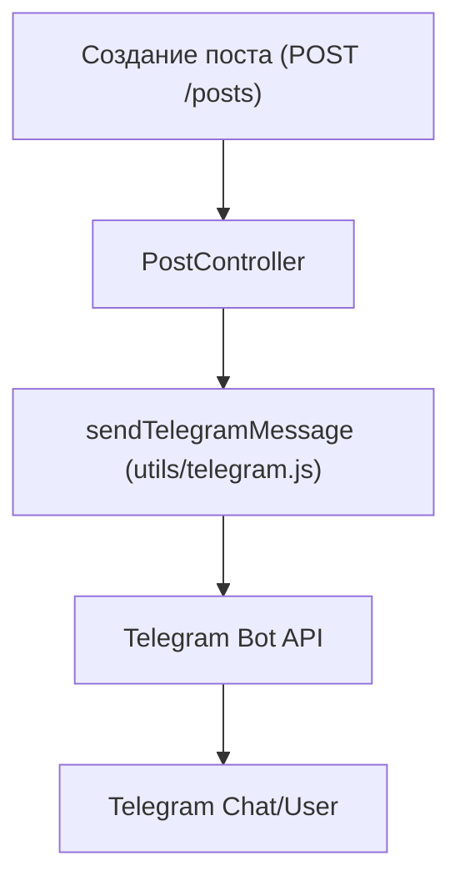

# Практическая работа 30: Интеграция с внешними сервисами

## Задание

- Интегрируйте проект с внешним сервисом (например, email-рассылка, Telegram-бот, Google Calendar).  
- Реализуйте обмен данными через API или SDK.  
- Проведите тестирование взаимодействия.

## Цель работы

Научиться подключать внешние сервисы к вашему проекту и организовывать обмен данными между системами.

## На примере проекта TaskManager

> «Нам нужно, чтобы TaskManager умел отправлять уведомления о задачах в Telegram или по email. Также можно синхронизировать задачи с Google Calendar.»

## Часть 1. Выбор сервиса

Выберите один из следующих вариантов:

- **Telegram**: уведомления о новых задачах через Telegram-бота.  
- **SMTP/SendGrid**: email-уведомления при создании задачи.  
- **Google Calendar API**: создание событий из задач.

## Часть 2. Интеграция

- Зарегистрируйте ключ/токен для доступа.  
- Используйте Python, JavaScript или другой удобный язык.  
- Реализуйте один кейс взаимодействия (например, при создании задачи отправляется сообщение в Telegram).

## Часть 3. Тестирование

Проверьте, что:

- интеграция сработала (уведомление пришло);  
- ошибки логируются или обрабатываются корректно;  
- повторные действия не вызывают дублирования.

## Пример отчёта

> «TaskManager интегрирован с Telegram-ботом. При создании новой задачи пользователь получает уведомление в Telegram. Использован бот API Telegram и библиотека python-telegram-bot. Интеграция протестирована — сообщения приходят корректно. Код — в скрипте notify_bot.py.»

